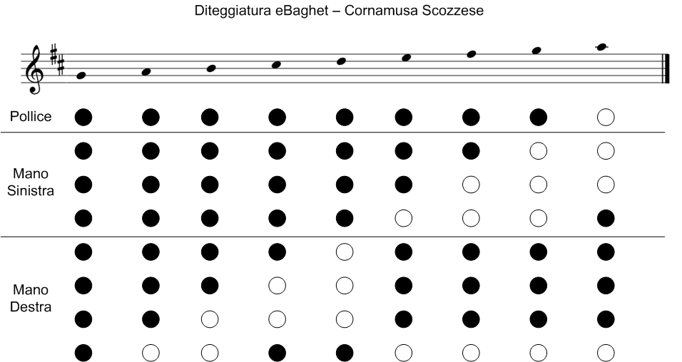
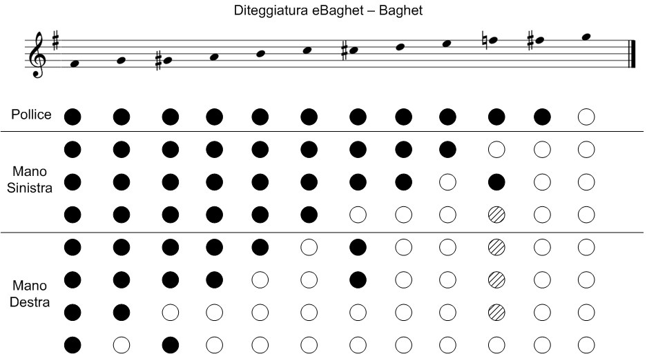

# eBaghet
[English](README_EN.md)

Progetto open souce di Baghet (cornamusa bergamasca) elettronica per Arduino.

Largamente basato su eChanter di Tim Malcolm 2010-2015 CC by-nc-sa. ([sito di eChanter](http://www.echanter.com/), [repository su Sourceforge](https://sourceforge.net/projects/echanter/))

Audio basato sulla libreria e sugli esempi di Mozzi Synth
Mozzi, Tim Barrass 2012, CC by-nc-sa.

Il suono della Baghet è stato fornito e registrato da [Valter Biella](http://www.baghet.it/)

## Istruzioni di montaggio:
Per ora, seguite l'eccellente guida sul [sito di eChanter](http://www.echanter.com/home/howto-build).

## Per programmare l'Arduino:
Scaricate e installate il programma [Arduino IDE](https://www.arduino.cc/en/main/software) (tested on version 1.8.3)

Scaricate e installate la libreria Mozzi dal [sito di Mozzi](http://sensorium.github.com/Mozzi/)

Aprite il file di configurazione della libreria Mozzi [Arduino dir]/libraries/Mozzi/mozzi_config.h
Se state usando la moodalità HIFI, trovate le linee che contengono AUDIO_MODE e assicuratevi che siano così:

          //#define AUDIO_MODE STANDARD
          //#define AUDIO_MODE STANDARD_PLUS
          #define AUDIO_MODE HIFI

Andate alle linee che contengono AUDIO_RATE e assicuratevi che siano così:

          //#define AUDIO_RATE 16384
          #define AUDIO_RATE 32768

Salvate mozzi_config.h

Aprite il programma Arduino IDE.
Aprite lo sketch eBaghet da dove l'avete estratto (eBaghet.ino è lo sketch principale).

A questo punto ci sono alcune cose che potete cambiare nel file di configurazione. Per modificare il file, cliccate sulla linguetta 'eBaghet_config' nell'Arduino IDE. Se non state usando i sensori capacitivi, cambiate la linea

      #define CAPTOUCH true

 in

      #define CAPTOUCH false

Se state usando i sensori capacitivi, allora potreste dover cambiare la sensibilità dei sensori in questa linea:

    #define CAPTOUCH_TRIGGER 6

cambiando il 6 in un valore più alto o più basso a seconda di come funziona il riconoscimento del tocco.

Connettete la scheda Arduino.
Selezionate la scheda dal menù strumenti (es. Arduino nano).
Selezionate il processore dal menù Strumenti (es. ATMega 328).
Selezionate la porta seriale dal menù strumenti.
Cliccate su "Carica".

## Opzioni

l'eBaghet ha diverse opzioni, selezionabili chiudendo alcuni tasti all'acensione:
* Se non si chiude nessun tasto, il chanter parte con il suono e la diteggiatura del Baghet (in SOL), senza bordoni.
* Se si chiude il tasto posterione (LA alto nella cornamusa), il chanter parte con il suono e la diteggiatura della cornamusa scozzese, senza bordoni.
* Se si chiude il primo tasto in alto (SOL alto nella cornamusa), nel baghet vengono aggiunti i due bordoni (intonati in SOL), e nella cornamusa i tre bordoni (intonati in LA).
* Se si chiude il secondo tasto in alto (FA nella cornamusa), in aggiunta al primo, solo nel baghet viene intonato il bordone maggiore sul LA, senza bordone minore.
* Se si chiude il terzo tasto in alto (MI nella cornamusa), in aggiunta al primo, solo nel baghet viene intonato il bordone maggiore sul DO, senza bordone minore.

## Diteggiatura

La cornamusa scozzese segue questa diteggiatura:

Il Baghet segue questa diteggiatura (rilevata dal [Manuale del Baghet](http://www.baghet.it/manuale%20baghet%202012.pdf) di Valter Biella):

I tasti tratteggiati possono essere chiusi o aperti, a seconda della comodità di posizione.
