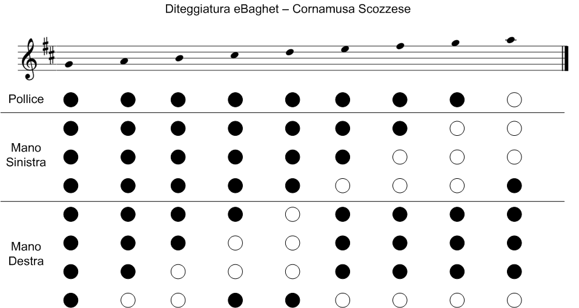
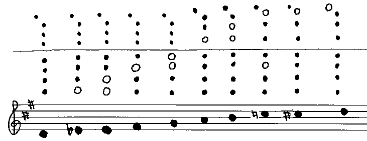
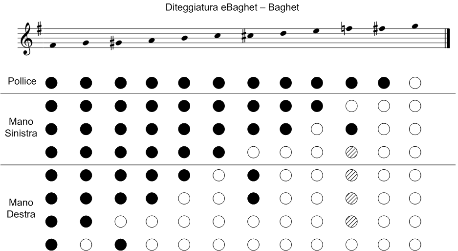

# eBaghet

Open source electronic pipes project for Arduino-compatible boards.

Currently includes:

- Baghet (Italian bagpipes)
- Great Highland Bagpipes
- Small Pipes
- Border Pipes
- Uilleann Pipes
- Gaita Gallega
- Gaita Asturiana (still in development)

Largely based on **eChanter** by Tim Malcolm (2010-2015, CC BY-NC-SA).  
Audio synthesis is based on the **Mozzi** sound library.

Sound for the Baghet is provided by [Valter Biella](http://www.baghet.it/).

## Hardware build

A step-by-step hardware build guide with photos is included in this repository:

- [Build guide](docs/build/BUILD.md)

That guide rewrites and updates the most useful ideas from the archived eChanter build notes, adapted to this project and to the documented Nano-based PVC build.

Archived historical reference:

- [Archived eChanter build guide](https://web.archive.org/web/20221204162813/http://www.echanter.com/home/howto-build)

## Software requirements

- Arduino IDE or PlatformIO
- **Mozzi 2.x** (official version)
- For Teensy 4.x builds: the additional **Timer** and **ADC** libraries required by Mozzi

## Current build status

The project is currently known to compile on:

- **Arduino Nano / ATmega328P**
- **STM32F1** boards with an updated STM32 core

Support for other platforms is being modernized.

### Notes about Teensy 4.x

Teensy 4 support is a work in progress.

Mozzi 2 includes Teensy 4 support, but eBaghet still needs platform-specific adaptation for:
- touch input handling
- audio output mode selection
- some hardware-dependent code paths

So Teensy 4 should currently be considered **experimental**.

## Important migration note
		  
Older versions of this project used a personal fork of Mozzi and required manual edits to `mozzi_config.h`.

This is no longer the recommended setup.
		
Configuration is now done directly in the sketch with `#define`s before including `Mozzi.h`.

## Configuration

Open `eBaghet.ino` and `eBaghet_config.h`.

### Audio configuration

Mozzi settings are now defined in the sketch, for example:

- `MOZZI_AUDIO_MODE`
- `MOZZI_AUDIO_RATE`
- `MOZZI_CONTROL_RATE`

Typical legacy equivalent values are:

- `MOZZI_AUDIO_RATE 32768`
- `MOZZI_CONTROL_RATE 256`

Depending on the board, different audio output modes may be required.

### Sample quality

You can enable high resolution samples by defining:

```cpp
	  #define USE_16BIT_SAMPLES true
```

### Instrument startup order

You can define the order in which instruments are presented:

```cpp
	  #define STARTING_INSTRUMENT	GHB
	  #define FIRST_INSTRUMENT	BGT
	  #define SECOND_INSTRUMENT	BRD
	  #define THIRD_INSTRUMENT	SML
	  #define FOURTH_INSTRUMENT	UIL
```

Where:

- `GHB` = Great Highland Bagpipes
- `BGT` = Baghet
- `BRD` = Border pipes
- `SML` = Small pipes
- `UIL` = Uilleann pipes
- `GAL` = Gaita gallega
- `AST` = Gaita asturiana

### Drone startup mode
	
You can define whether the chanter starts with drone sound enabled:

```cpp
	  #define STARTING_DRONES	DRONE_ON
```
	
or disabled:

```cpp
	  #define STARTING_DRONES	DRONE_OFF
```

For the Baghet you can also define the initial drone intonation:

```cpp
	  #define STARTING_DRONE_INT	DRONE_INT_STANDARD
```

Available options:

- `DRONE_INT_STANDARD`
- `DRONE_INT_A`
- `DRONE_INT_C`

### Finger sensor type

You can select the fingering sensor type with:

```cpp
	  #define TOUCHMODE TOUCH_CAP
```

Available options are:

- `TOUCH_CAP` = direct capacitive sensing
- `TOUCH_SWITCH` = standard pushbuttons
- `TOUCH_MPR121` = external MPR121 capacitive controller

### Important note about TOUCH_CAP

`TOUCH_CAP` is the legacy direct capacitive sensing mode.
	  
It works on supported platforms, but it is hardware-dependent and may require board-specific adaptation.  
For new ports, `TOUCH_SWITCH` or `TOUCH_MPR121` are often easier starting points.

### Capacitive trigger threshold

If you use `TOUCH_CAP`, you may want to adjust:

```cpp
      #define CAPTOUCH_TRIGGER 4
```

Higher or lower values may work better depending on wiring, pads and environment.

### Volumes

You can define relative chanter/drone volumes for each instrument, for example:

```cpp
	  #define GHB_CHANTER_VOLUME	8
	  #define GHB_DRONES_VOLUME	4
      
	  #define BGT_CHANTER_VOLUME	8
	  #define BGT_DRONES_VOLUME	4
      
	  #define BRD_CHANTER_VOLUME	8
	  #define BRD_DRONES_VOLUME	8
      
	  #define SML_CHANTER_VOLUME	8
	  #define SML_DRONES_VOLUME	8
      
	  #define UIL_CHANTER_VOLUME	8
	  #define UIL_DRONES_VOLUME	8

	  #define GAL_CHANTER_VOLUME	8
	  #define GAL_DRONES_VOLUME	8
	  
	  #define AST_CHANTER_VOLUME	8
	  #define AST_DRONES_VOLUME	8
```

Values go from **1** (minimum) to **8** (maximum).

### Sensor pins

Finger sensor pins are defined in `eBaghet_config.h`.

Board-specific pin mappings may differ, so check that file and adjust according to your target platform.

## Uploading the sketch
	  
1. Connect the board
2. Select the correct board from the IDE
3. Select the correct processor/options if required
4. Select the serial port
5. Upload the sketch

## Startup options

The eBaghet has several startup modes depending on which keys are closed when the chanter is powered on:

- No key closed: starts with `STARTING_INSTRUMENT`
- High A closed: starts with `FIRST_INSTRUMENT`
- High G closed: starts with `SECOND_INSTRUMENT`
- F closed: starts with `THIRD_INSTRUMENT`
- E closed: starts with `FOURTH_INSTRUMENT`
- D closed: toggles drones on/off relative to `STARTING_DRONES`
- C closed (Baghet only): changes drones to A
- B closed (Baghet only): changes drones to C

## Fingering charts

Great Highland Bagpipes, Border Pipes and Small Pipes:



Uilleann Pipes:



Baghet  
(according to the *Manuale del Baghet* by Valter Biella):



Dashed keys can be open or closed depending on comfort and position.

## Roadmap

Planned future work includes:

- ESP32-S3 support
- pressure sensor input
- realistic pitch variation
- I2S audio output
- MIDI output
- Bluetooth MIDI
