# Building a simple eBaghet / eChanter-style chanter

This guide rewrites and updates the most useful hardware ideas from the archived **eChanter v3** build notes, using the Nano-based PVC build shown in the photo sequence below.

It is **not** a verbatim copy of the original page. It is an updated practical guide for a simple DIY build that matches this repository more closely.

Archived reference:
- <https://web.archive.org/web/20221204162813/http://www.echanter.com/home/howto-build>

This example build uses:

- a straight PVC tube body
- an Arduino Nano
- direct finger contacts
- a compact headphone jack sub-assembly
- a single-cell battery holder with a 5 V boost converter
- a power switch
- end caps or housings for the top and bottom ends

> Safety note  
> Drilling, cutting, soldering, batteries and boost converters can all cause damage or injury if handled badly. Build and use this project entirely at your own risk.

---

## 1. Overview

The original eChanter guide was designed around a low-cost, easy-to-build electronic chanter body made from PVC or sprinkler-style parts, with direct finger sensors and an Arduino-compatible board.

That basic idea still works very well.

For the **software side**, follow the current **eBaghet** repository and its current Mozzi-based configuration. Do **not** follow the old archived instructions about editing `mozzi_config.h` or using the old legacy Mozzi setup.

---

## 2. Main parts

Suggested parts for a simple build like this:

- 1 PVC tube for the chanter body
- 1 Arduino Nano or compatible board
- 8 finger contacts
- insulated hookup wire
- 1 mono or stereo headphone jack
- passive components for the audio output filter / mixer
- 1 power switch
- 1 single-cell battery holder
- 1 boost converter to 5 V
- end caps or housings for the top and bottom ends

Useful tools:

- drill and drill bits
- soldering iron and solder
- wire stripper / cutter
- pliers
- ruler or caliper
- marker for layout lines
- hot glue, epoxy or another strain-relief method

### Parts overview

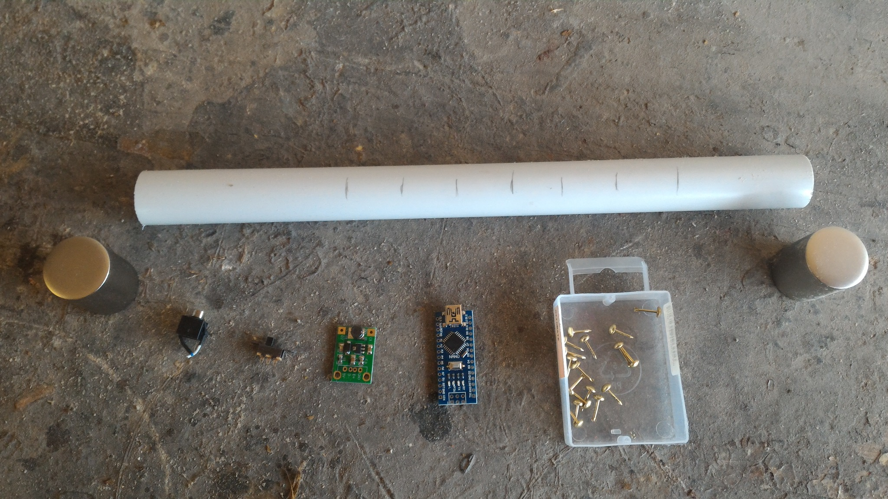

---

## 3. Hole layout

Mark a straight center line along the **front** of the tube and another line exactly opposite on the **back**.

Use these sensor positions, measured from the **top** of the chanter body:

| Sensor | Distance from top |
|---|---:|
| High A | 71 mm |
| High G | 90 mm |
| F | 111 mm |
| E | 137 mm |
| D | 159 mm |
| C | 180 mm |
| B | 209 mm |
| Low A | 244 mm |

Important:

- **High A** goes on the **back** of the chanter.
- All the other sensors go on the **front**.

### Marking and drilling

Keep the visible sensor holes straight and evenly spaced. Crooked spacing is very noticeable on the finished instrument.

Front sensor layout:

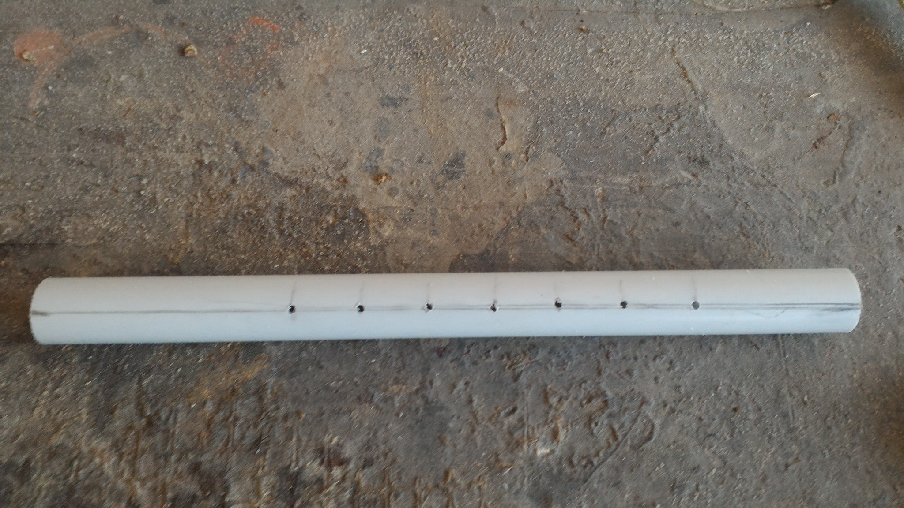

Rear High A position:

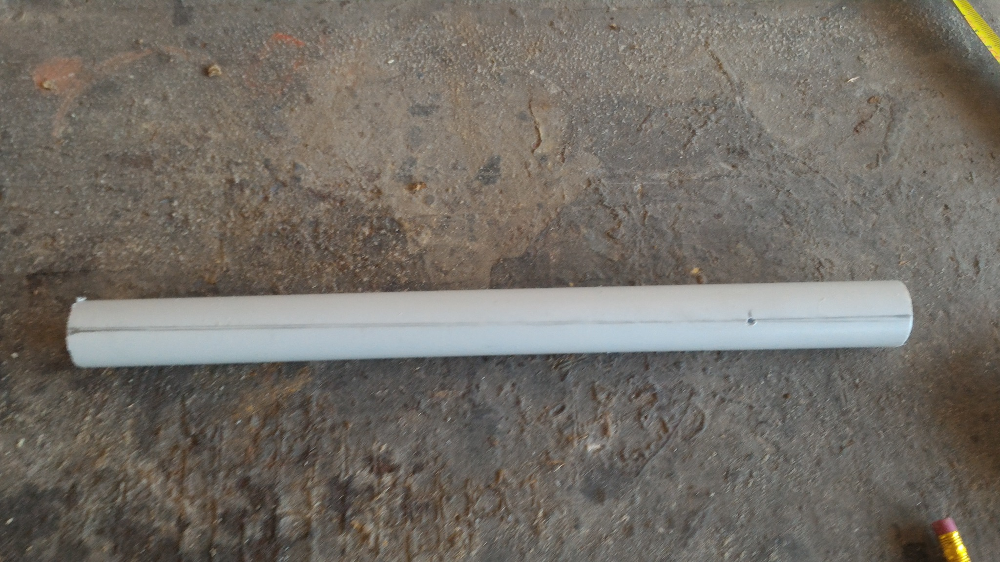

---

## 4. Preparing the body

A simple workflow is:

1. cut the PVC tube to length
2. mark the front and back center lines
3. mark the finger positions
4. drill the visible contact holes
5. drill any extra wiring or switch openings
6. dry-fit the end pieces before permanent wiring

For a first build, a plain straight body is usually better than trying to imitate a traditional acoustic chanter shape.

---

## 5. Power system

This build uses a single-cell battery holder feeding a small boost converter, then a switch, then the Nano.

A simple order is:

1. connect the battery holder to the boost converter input
2. connect the boost converter output to the switch and board power lines
3. verify a stable 5 V output before connecting the Arduino
4. mount the battery holder, boost converter and switch in one end section

### Battery holder and boost converter

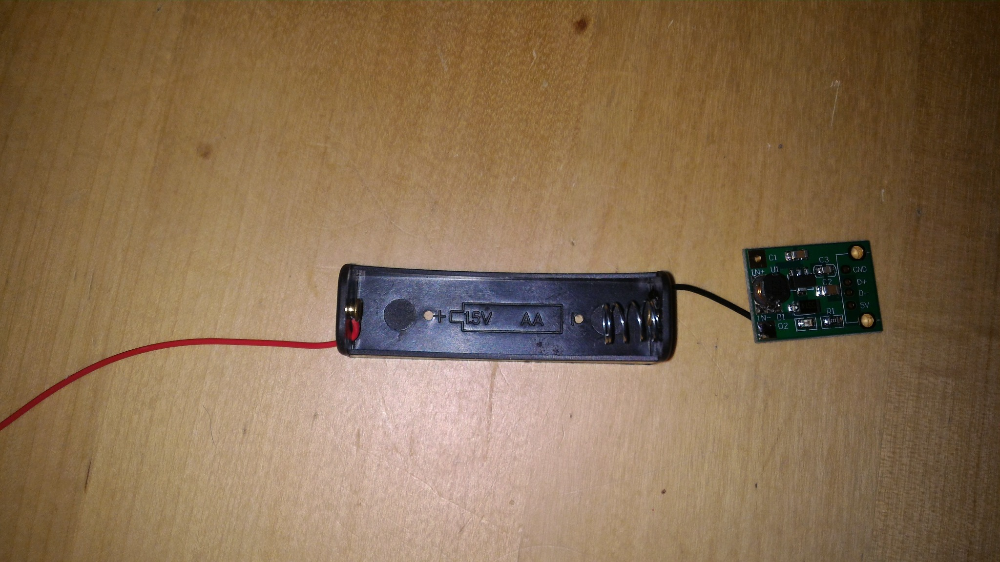

### Routing the boost converter and switch

This photo shows the **boost converter** and the **power switch** being routed into the body. It is not a pressure sensor assembly.

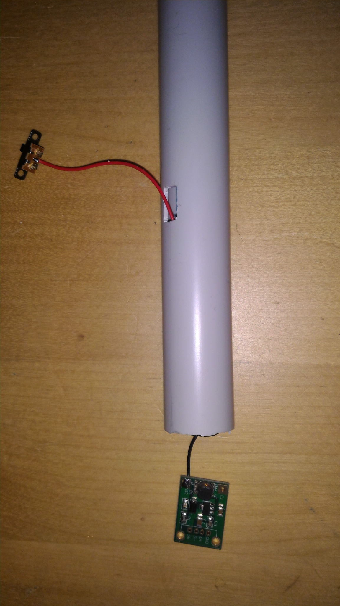

### Fitting the boost converter, switch and battery holder

This photo shows the mechanical fitting of the **boost converter**, **switch** and **battery holder** in the end section.

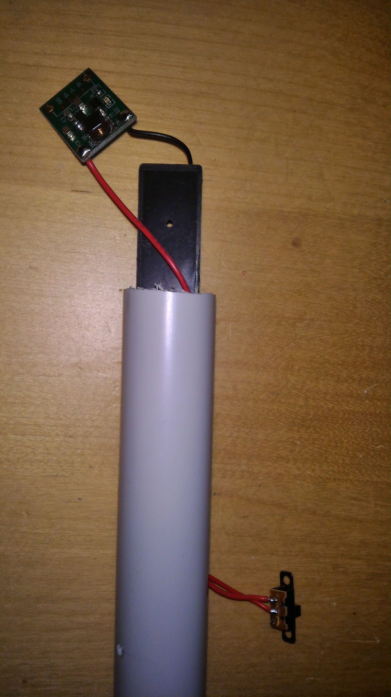

### Good habits

- check polarity every time before powering up
- insulate exposed solder joints
- do not force the battery holder into the tube if it stresses the wires

---

## 6. Finger sensors

The archived eChanter guide described several sensor styles, including screw-and-wire contacts, brass contacts and other simple DIY direct-touch methods.

This build uses a compact direct-contact approach:

- one wire per note
- each wire routed inside the PVC body
- each wire soldered to a small metal contact
- the contacts mounted flush or near-flush through the outer wall

### Practical recommendations

- label every wire before routing it
- leave enough slack at the Nano end
- test continuity before closing the body
- add glue or epoxy inside if any contact can rotate or loosen

### Original eChanter Nano pin order

If you want to follow the archived Nano-style pinout, the finger sensors were assigned like this:

| Finger | Arduino pin |
|---|---:|
| High A | D12 |
| High G | D8 |
| F | D7 |
| E | D6 |
| D | D5 |
| C | D4 |
| B | D3 |
| Low A | D2 |

Check the current `eBaghet_config.h` before soldering permanently, especially if you are changing board family or touch mode.

### Routing the sensor wires

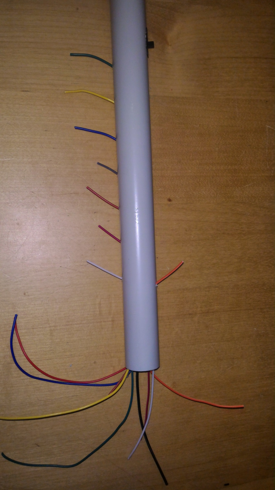

### Preparing the contacts

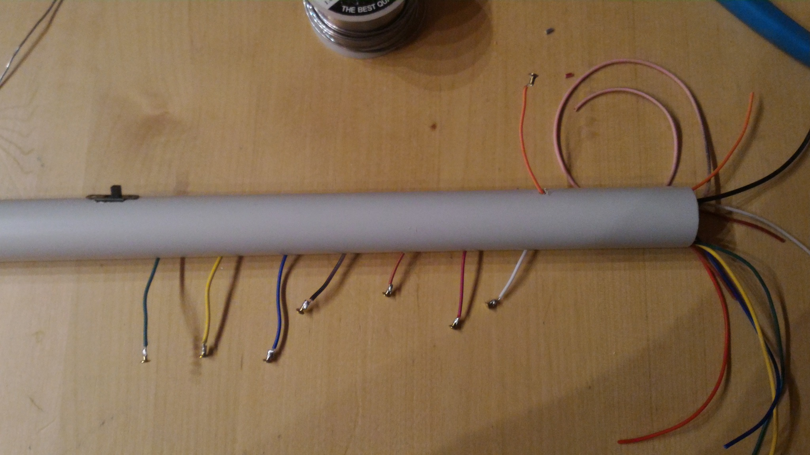

### Installing the contacts

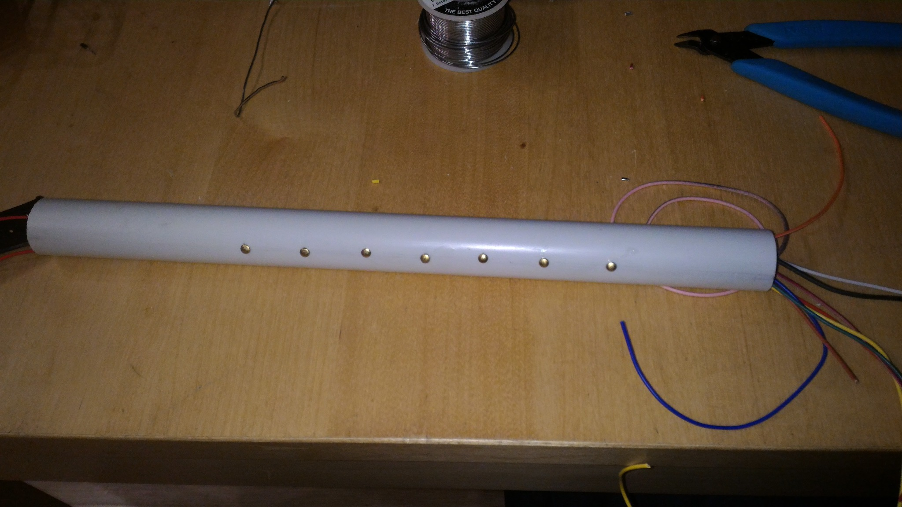

### Sensor side complete

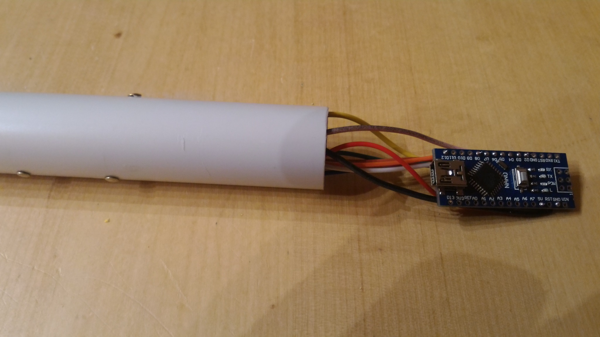

---

## 7. Audio output

The archived eChanter guide originally used a simple Arduino headphone output and, for the old Mozzi setup, strongly preferred the old two-pin **HIFI** mode on pins 9 and 10.

For the current eBaghet repository, the exact best output mode depends on the board you are targeting, so treat the archived audio wiring as **historical inspiration**, not as a mandatory rule.

This Nano build uses a compact headphone jack sub-assembly with passive parts soldered directly at the jack.

### Audio jack parts

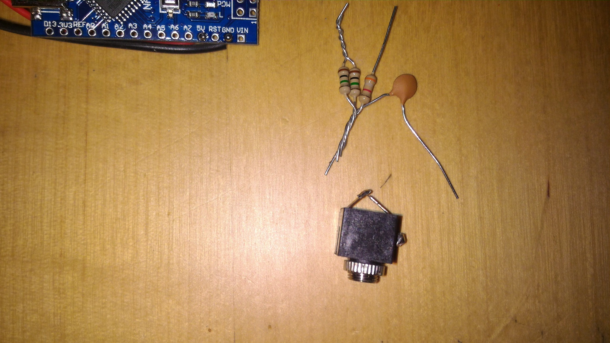

### Audio jack assembled

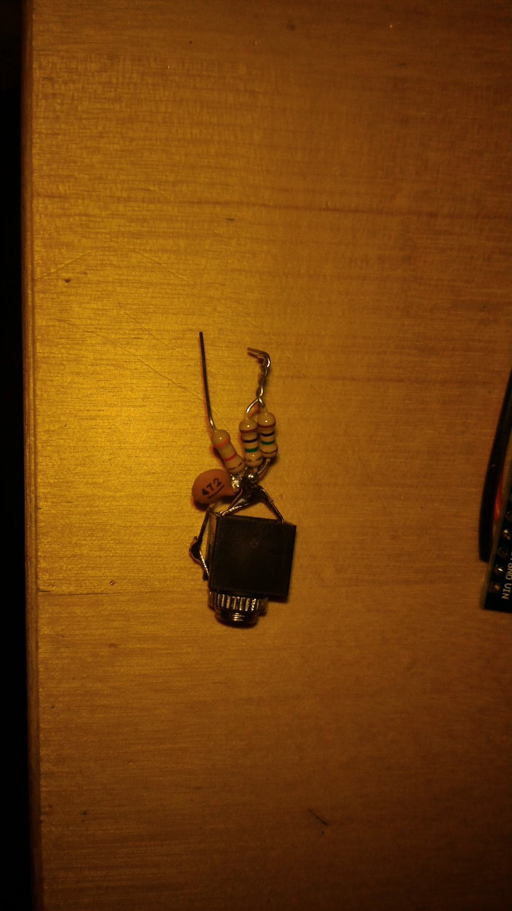

### Nano plus audio sub-assembly

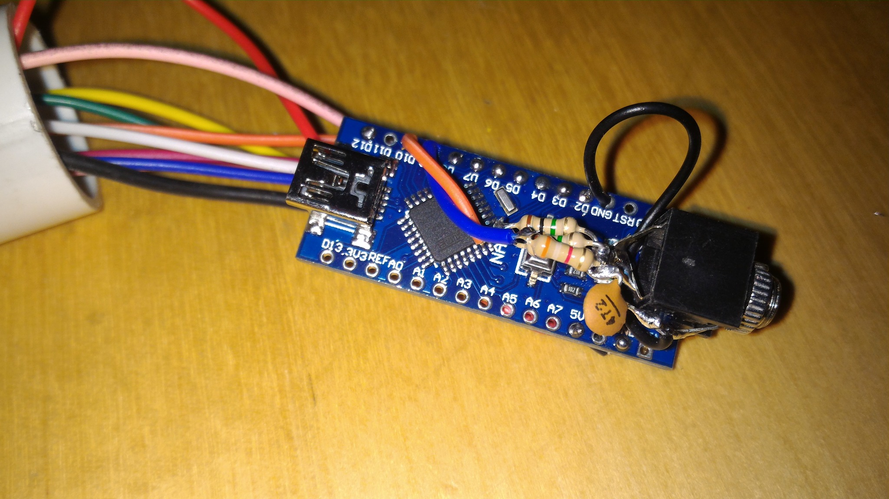

### Output variants

For classic Arduino Nano / ATmega328P style builds, there are two simple analog output variants worth documenting.

#### Variant A: single PWM (`MOZZI_OUTPUT_PWM`)

This is the simpler option. It uses one PWM output pin and a basic RC low-pass filter.

Typical Nano-style example:

- PWM output from **D9**
- **R1 = 270 ohm** in series with the output
- **C1 = 100 nF** from the filtered output node to ground
- audio taken from the filtered output node and ground

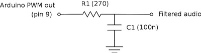

This is the easiest output stage to build and debug. It is a good choice for quick testing, for simple headphone or amplified-speaker experiments, and for ports where you want to start with the least hardware.

#### Variant B: two-pin PWM (`MOZZI_OUTPUT_2PIN_PWM`, formerly `HIFI`)

This is the classic higher-quality dual-PWM network used by old Mozzi Nano builds and by the original eChanter-style approach.

In the original Nano-style wiring shown here:

- one PWM output goes through **R1 = 499k 0.5%**
- the other PWM output goes through **R2 = 3.9k 0.5%**
- **C1 = 4.7 nF** goes from the mixed output node to ground
- audio is taken from the mixed output node and ground

On the Arduino Nano / ATmega328P example shown in the schematic, the two PWM pins are **D10** and **D9**.

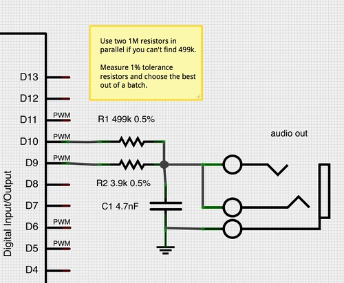

Practical note:

- if you cannot find a **499k** resistor, two matched **1M** resistors in parallel are a reasonable substitute
- choose resistors carefully if possible, because this network depends on ratio accuracy more than the simple single-PWM filter does
- on modern non-AVR targets, always verify the actual Mozzi output mode and default pins for that board instead of assuming the Nano pinout

### Practical advice

- keep the jack wiring short
- add strain relief after testing
- if you hear buzz or distortion, revisit grounding and filtering
- for future ESP32-S3 builds, prefer I2S audio rather than copying the old Nano output stage blindly

---

## 8. Pressure sensor support

The archived eChanter guide included a pressure sensor input.

**The current eBaghet repository does not support a pressure sensor yet.**

Pressure sensing may be added in the future, but for now it should be considered **not yet implemented** in the project.

So for the current build guide:

- there is **no required pressure sensor wiring**
- there is **no supported pressure sensor assembly step**
- any pressure-sensor hardware should be treated as an experimental custom modification, not as part of the standard build

---

## 9. Internal wiring and assembly order

A good practical order is:

1. prepare the tube and drill all holes
2. prepare the finger contacts and wires
3. install all sensor wires through the body
4. solder the contact ends
5. prepare the headphone jack sub-assembly
6. prepare the battery holder and boost converter
7. install the switch
8. route all wires to the Nano end
9. solder the Nano connections
10. test every finger input
11. test audio
12. test power switching
13. only then glue or secure the parts in place

---

## 10. Dry fit and final assembly

Before final closure, it is worth doing at least one dry fit with all main sections in place.

### Dry fit with both end sections

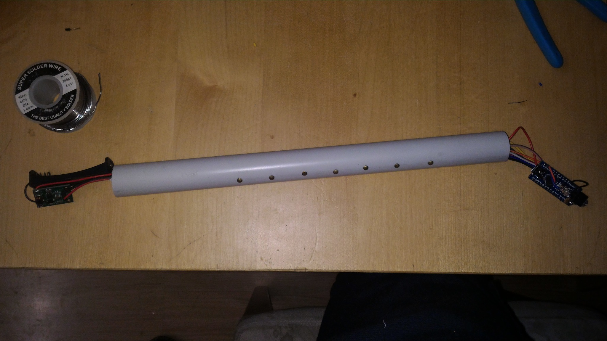

### Body with end caps fitted

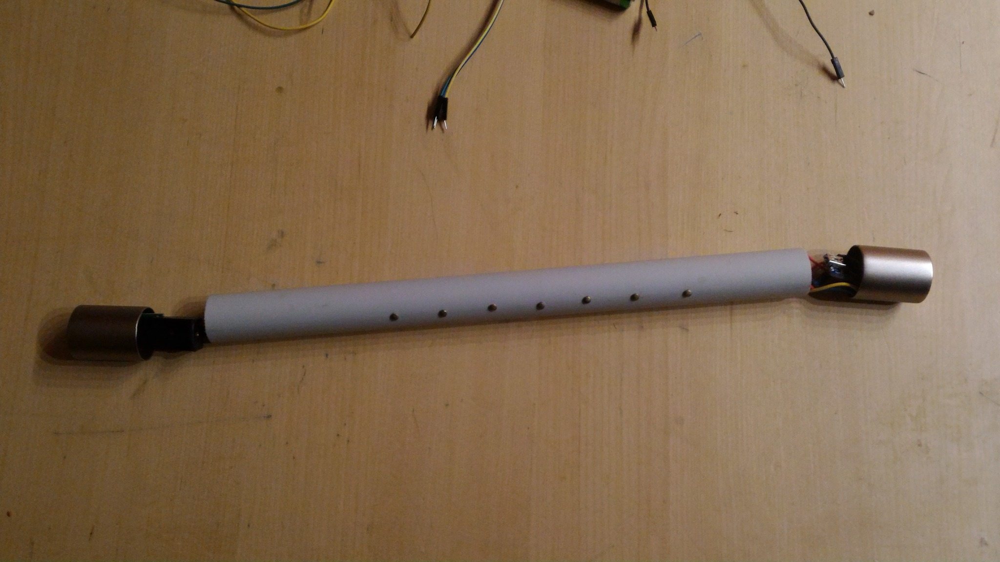

### Finished simple chanter

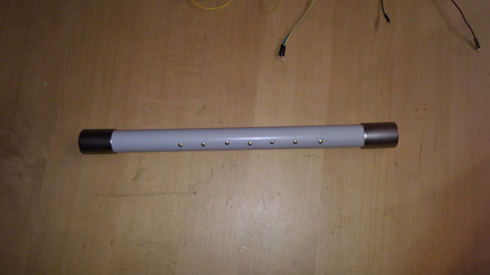

---

## 11. Final notes

This build is intentionally simple. That is a strength, not a weakness.

It is enough to:

- prove the software and finger logic
- test audio on real hardware
- provide a cheap mechanical platform before moving to better enclosures or more advanced electronics

If you build a more modern version of eBaghet on STM32, Teensy or ESP32-S3, this same mechanical layout can still be a useful first prototype even if the internal electronics change significantly.
